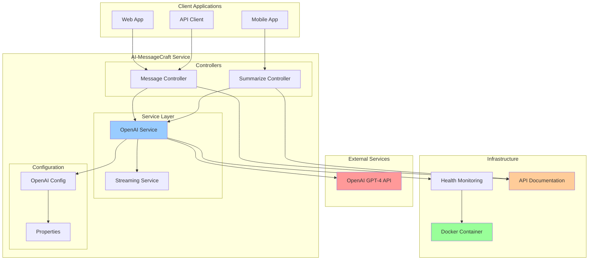
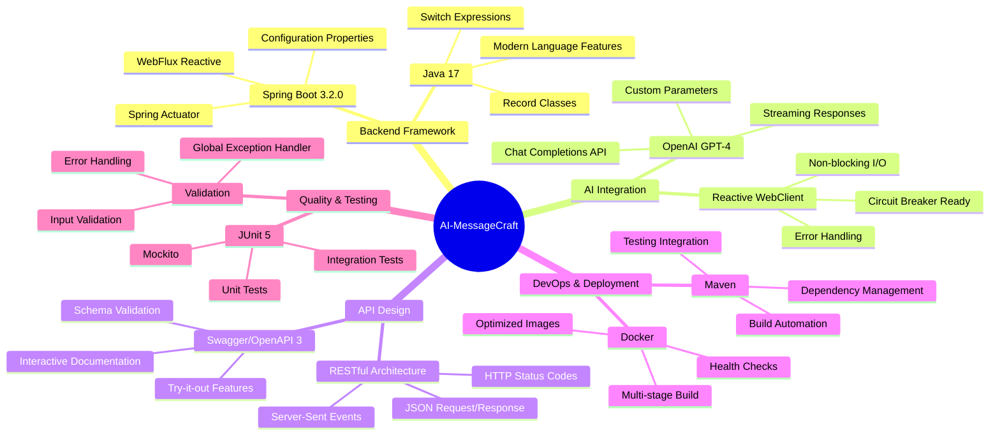
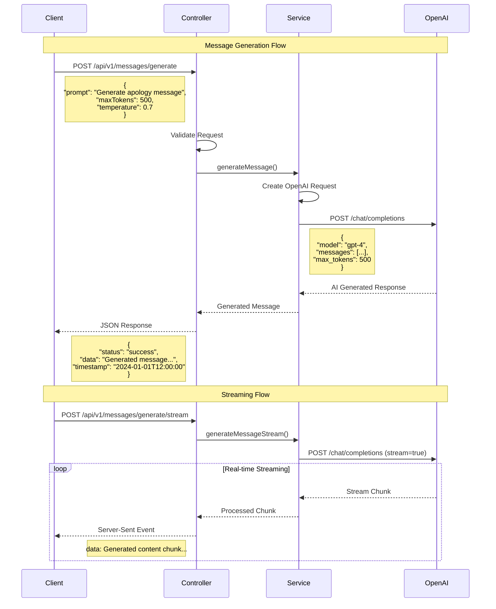
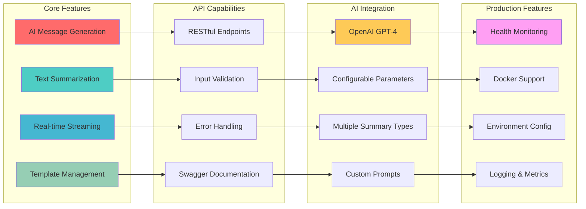
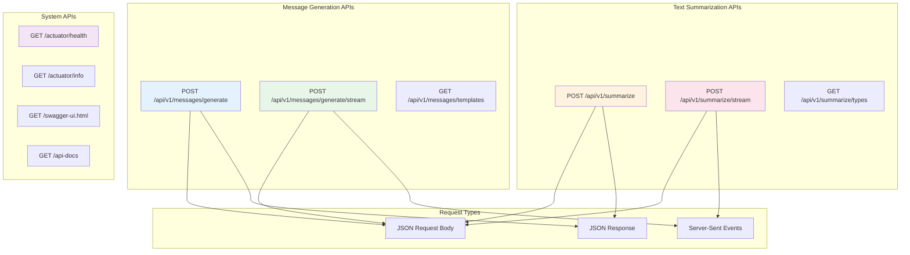
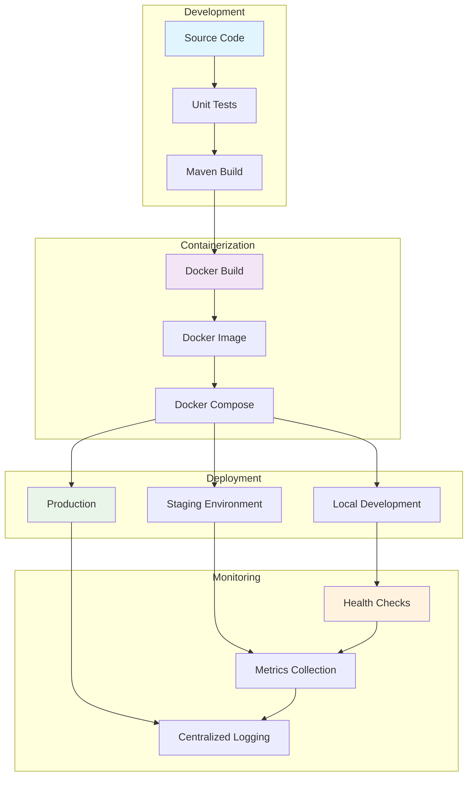

# AI-MessageCraft 🤖✨

**Professional AI-Powered Message Generation & Summarization Service**

A modern Spring Boot microservice showcasing enterprise-grade OpenAI GPT-4 integration for generating professional customer messages and intelligent text summarization with real-time streaming capabilities.


---

## 🏗️ System Architecture



## 🛠 Technology Stack & Features



---

## 🚀 Features

- **AI-Powered Message Generation**: Generate professional customer service messages using GPT-4
- **Intelligent Text Summarization**: Summarize customer feedback and messages in various formats
- **Real-time Streaming**: Stream responses in real-time for better user experience
- **RESTful API**: Clean, well-documented REST endpoints
- **Input Validation**: Comprehensive request validation with detailed error messages
- **Error Handling**: Robust error handling with meaningful error responses
- **Swagger Documentation**: Interactive API documentation with Swagger UI
- **Health Monitoring**: Built-in health checks and monitoring endpoints
- **Configurable**: Environment-based configuration for different deployment scenarios

## 📋 Prerequisites

- Java 17 or higher
- Maven 3.6+
- OpenAI API Key

## 🔧 Setup & Installation

### 1. Clone the Repository
```bash
git clone https://github.com/yourusername/ai-messagecraft.git
cd ai-messagecraft
```

### 2. Configure Environment Variables
Create a `.env` file or set environment variables:

```bash
export OPENAI_API_KEY=your-openai-api-key-here
export OPENAI_MODEL=gpt-4  # Optional, defaults to gpt-4
export OPENAI_MAX_TOKENS=1000  # Optional, defaults to 1000
export OPENAI_TEMPERATURE=0.7  # Optional, defaults to 0.7
```

### 3. Build the Application
```bash
mvn clean compile
```

### 4. Run the Application
```bash
mvn spring-boot:run
```

The application will start on `http://localhost:8080`

## 🎬 Live Demo


### Quick Start Demo
```bash
# Test the API instantly
curl -X POST http://localhost:8080/api/v1/messages/generate \
  -H "Content-Type: application/json" \
  -d '{"prompt": "Create a professional thank you message"}'
```

### Real-time Streaming
```bash
# Watch AI generate content in real-time
curl -N -X POST http://localhost:8080/api/v1/messages/generate/stream \
  -H "Accept: text/event-stream" \
  -d '{"prompt": "Write a welcome message for new customers"}'
```

## 🔄 Message Flow & Streaming



## 🎯 Core Features Overview



## 📖 API Documentation

Once the application is running, you can access:

- **Swagger UI**: http://localhost:8080/swagger-ui.html
- **API Docs**: http://localhost:8080/api-docs
- **Health Check**: http://localhost:8080/actuator/health

### 📚 Additional Documentation
- [🏗️ Architecture Overview](docs/ARCHITECTURE.md)
- [📋 Complete API Examples](docs/API_EXAMPLES.md)
- [🎯 Live Demo Guide](assets/demo-banner.md)

## 🔌 API Endpoints Overview



### Message Generation

#### Generate Message (Non-streaming)
```http
POST /api/v1/messages/generate
Content-Type: application/json

{
  "prompt": "Generate a professional apology for delayed shipping",
  "maxTokens": 500,
  "temperature": 0.7,
  "messageType": "apology"
}
```

#### Generate Message (Streaming)
```http
POST /api/v1/messages/generate/stream
Content-Type: application/json
Accept: text/event-stream

{
  "prompt": "Generate a professional welcome message for new customers",
  "maxTokens": 300,
  "temperature": 0.8,
  "messageType": "welcome"
}
```

#### Get Message Templates
```http
GET /api/v1/messages/templates
```

### Text Summarization

#### Summarize Text (Non-streaming)
```http
POST /api/v1/summarize
Content-Type: application/json

{
  "text": "Long customer feedback text to be summarized...",
  "maxTokens": 150,
  "summaryType": "bullet_points"
}
```

#### Summarize Text (Streaming)
```http
POST /api/v1/summarize/stream
Content-Type: application/json
Accept: text/event-stream

{
  "text": "Customer feedback text...",
  "maxTokens": 200,
  "summaryType": "brief"
}
```

#### Get Summary Types
```http
GET /api/v1/summarize/types
```

## 📊 Response Format

### Standard API Response
```json
{
  "status": "success",
  "message": "Message generated successfully",
  "data": "Generated message content here...",
  "error": null,
  "timestamp": "2024-01-01T12:00:00"
}
```

### Error Response
```json
{
  "status": "error",
  "message": "Validation failed",
  "data": null,
  "error": "Invalid input parameters",
  "timestamp": "2024-01-01T12:00:00"
}
```

### Streaming Response
```
data: Generated content chunk 1

data: Generated content chunk 2

data: Generated content chunk 3

```

## 🎯 Use Cases

### Customer Service
- Generate professional responses to customer complaints
- Create welcome messages for new customers
- Draft follow-up communications
- Produce resolution confirmations

### Content Management
- Summarize customer feedback for analysis
- Create executive summaries of support tickets
- Generate bullet-point summaries for reporting
- Extract key points from lengthy communications

## 🚀 Deployment & DevOps Pipeline



## 🏗 Clean Architecture Pattern

The application follows a clean architecture pattern:

```
src/main/java/com/portfolio/summarize/
├── config/          # Configuration classes
├── controller/      # REST controllers
├── dto/            # Data Transfer Objects
├── exception/      # Exception handling
├── model/          # Domain models
└── service/        # Business logic
```

### Key Components

- **OpenAiService**: Core service for OpenAI API integration
- **MessageController**: Handles message generation endpoints
- **SummarizeController**: Handles text summarization endpoints
- **GlobalExceptionHandler**: Centralized error handling
- **OpenAiProperties**: Configuration properties management

## 🧪 Testing

Run tests with:
```bash
mvn test
```

## 🚀 Deployment

### Docker Deployment
```dockerfile
FROM openjdk:17-jdk-slim
COPY target/summarize-srv-1.0.0.jar app.jar
EXPOSE 8080
ENTRYPOINT ["java", "-jar", "/app.jar"]
```

### Environment Variables for Production
```bash
OPENAI_API_KEY=your-production-api-key
OPENAI_MODEL=gpt-4
SPRING_PROFILES_ACTIVE=prod
```

### Quick Deployment with Docker Compose
```bash
# Copy environment template
cp .env.example .env
# Edit .env with your OpenAI API key
# Start the service
docker-compose up -d
```

## 📈 Monitoring & Health Checks

The application includes built-in monitoring:

- Health endpoint: `/actuator/health`
- Info endpoint: `/actuator/info`
- Metrics endpoint: `/actuator/prometheus` (if enabled)

## 🔒 Security Considerations

- API key is externalized via environment variables
- Input validation on all endpoints
- CORS configuration (adjust for production)
- Rate limiting should be implemented for production use

## 🤝 Contributing

This is a portfolio project demonstrating AI integration skills. For improvements or suggestions:

1. Fork the repository
2. Create a feature branch
3. Submit a pull request

## 📜 License

This project is created for portfolio demonstration purposes.

## 🎯 Portfolio Highlights

This project demonstrates:

- **Modern Spring Boot Development**: Using Spring Boot 3.x with Java 17
- **Reactive Programming**: WebFlux for streaming responses
- **AI Integration**: Professional OpenAI GPT-4 integration
- **API Design**: RESTful API design with proper documentation
- **Error Handling**: Comprehensive error handling and validation
- **Configuration Management**: Externalized configuration for different environments
- **Code Quality**: Clean, maintainable code with proper logging
- **Documentation**: Comprehensive API documentation with Swagger

---

**Built with ❤️ for demonstrating AI integration capabilities in enterprise applications.** 