# AI-MessageCraft Architecture

## System Overview

AI-MessageCraft is a Spring Boot microservice designed to showcase enterprise-grade AI integration capabilities. The service provides RESTful APIs for message generation and text summarization using OpenAI's GPT-4 model.

## System Architecture Overview

```mermaid
graph TB
    subgraph "Client Layer"
        WEB[Web Applications]
        MOBILE[Mobile Apps]
        CLI[CLI Tools]
        API[API Clients]
    end
    
    subgraph "Load Balancer"
        LB[Nginx/ALB]
    end
    
    subgraph "AI-MessageCraft Microservice"
        subgraph "Presentation Layer"
            MSG_CTRL[MessageController<br/>📝 Generate Messages]
            SUM_CTRL[SummarizeController<br/>📄 Summarize Text]
            HEALTH_CTRL[Health Controller<br/>🏥 Monitoring]
        end
        
        subgraph "Business Layer"
            AI_SVC[OpenAiService<br/>🤖 AI Integration]
            STREAM_SVC[Streaming Service<br/>📡 Real-time Data]
            CONFIG_SVC[Configuration Service<br/>⚙️ Settings]
        end
        
        subgraph "Infrastructure Layer"
            WEBCLIENT[WebClient<br/>🌐 HTTP Client]
            VALIDATION[Validation<br/>✅ Input Checks]
            ERROR_HANDLER[Error Handler<br/>❌ Exception Management]
        end
    end
    
    subgraph "External Services"
        OPENAI[OpenAI GPT-4 API<br/>🧠 AI Processing]
    end
    
    subgraph "Deployment Infrastructure"
        DOCKER[Docker Container<br/>🐳 Containerization]
        METRICS[Actuator Metrics<br/>📊 Health Monitoring]
        SWAGGER[Swagger UI<br/>📚 API Documentation]
    end
    
    WEB --> LB
    MOBILE --> LB
    CLI --> LB
    API --> LB
    
    LB --> MSG_CTRL
    LB --> SUM_CTRL
    LB --> HEALTH_CTRL
    
    MSG_CTRL --> AI_SVC
    SUM_CTRL --> AI_SVC
    HEALTH_CTRL --> METRICS
    
    AI_SVC --> STREAM_SVC
    AI_SVC --> CONFIG_SVC
    AI_SVC --> WEBCLIENT
    
    MSG_CTRL --> VALIDATION
    SUM_CTRL --> VALIDATION
    VALIDATION --> ERROR_HANDLER
    
    WEBCLIENT --> OPENAI
    
    MSG_CTRL --> SWAGGER
    SUM_CTRL --> SWAGGER
    HEALTH_CTRL --> SWAGGER
    
    AI_SVC --> DOCKER
    METRICS --> DOCKER
    
    style OPENAI fill:#ff9999,stroke:#ff6666,stroke-width:3px
    style AI_SVC fill:#99ccff,stroke:#6699ff,stroke-width:3px
    style DOCKER fill:#99ff99,stroke:#66cc66,stroke-width:3px
    style SWAGGER fill:#ffcc99,stroke:#ff9966,stroke-width:3px
    style STREAM_SVC fill:#ff99ff,stroke:#ff66ff,stroke-width:3px
```

## Component Interaction Flow

```mermaid
sequenceDiagram
    participant Client as 👤 Client
    participant Controller as 🎮 Controller
    participant Service as ⚙️ AI Service
    participant Config as 🔧 Config
    participant WebClient as 🌐 WebClient
    participant OpenAI as 🤖 OpenAI API
    
    Note over Client,OpenAI: Message Generation Request
    
    Client->>Controller: POST /messages/generate
    Controller->>Controller: Validate Request
    Controller->>Service: generateMessage()
    
    Service->>Config: Get API Configuration
    Config-->>Service: API Key, Model, Settings
    
    Service->>WebClient: Create HTTP Request
    WebClient->>OpenAI: POST /chat/completions
    
    OpenAI-->>WebClient: AI Generated Response
    WebClient-->>Service: Parsed Response
    Service-->>Controller: Generated Message
    Controller-->>Client: JSON Response with Message
    
    Note over Client,OpenAI: Error Handling Flow
    
    alt OpenAI API Error
        OpenAI-->>WebClient: Error Response
        WebClient-->>Service: Exception
        Service-->>Controller: Handled Error
        Controller-->>Client: Error Response
    end
```

## Component Details

### Presentation Layer
- **MessageController**: Handles message generation requests (streaming and non-streaming)
- **SummarizeController**: Manages text summarization operations
- **GlobalExceptionHandler**: Centralized error handling and response formatting

### Business Layer
- **OpenAiService**: Core service managing OpenAI API interactions
- **Streaming Handler**: Manages real-time response streaming using WebFlux

### Configuration Layer
- **OpenAiProperties**: Type-safe configuration properties
- **WebClientConfig**: HTTP client configuration for external API calls

## Data Flow

### Message Generation Flow
1. Client sends generation request to MessageController
2. Controller validates input and delegates to OpenAiService
3. Service constructs OpenAI API request with proper formatting
4. OpenAI processes request and returns generated content
5. Service processes response and returns to client

### Streaming Flow
1. Client establishes Server-Sent Events connection
2. Service initiates streaming request to OpenAI
3. Real-time chunks are processed and forwarded to client
4. Connection maintained until completion or client disconnect

## Technology Stack

- **Framework**: Spring Boot 3.2.0 with WebFlux
- **Language**: Java 17
- **Build Tool**: Maven
- **Documentation**: Swagger/OpenAPI 3
- **Containerization**: Docker
- **Monitoring**: Spring Actuator
- **Testing**: JUnit 5, Mockito

## Security Considerations

- API keys externalized via environment variables
- Input validation on all endpoints
- Rate limiting (recommended for production)
- CORS configuration for cross-origin requests
- Health checks for monitoring

## Scalability

- Stateless design enables horizontal scaling
- Reactive programming model for efficient resource utilization
- Docker containerization for consistent deployment
- Health checks for load balancer integration

## Error Handling

- Comprehensive exception handling with meaningful error messages
- Circuit breaker pattern (recommended for production)
- Graceful degradation when external services are unavailable
- Structured error responses with proper HTTP status codes 